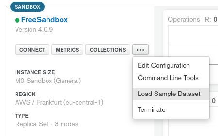
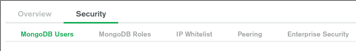

# MongoDB Atlas & MongoDB Stitch Workshop

## Objectives

In this workshop, you will discover more about MongoDB Atlas, the Database as a Service (DBaaS) by MongoDB and MongoDB Stitch,
the serverless platform which can be used to build different things like a REST API on top of your MongoDB clusters,
interconnect MongoDB with AWS or Twilio services for example, host a frontend or build a mobile application while enforcing
security rules. 

## Let's do it

### MongoDB Atlas

First, you will need to create a [MongoDB Replica Set](https://docs.mongodb.com/manual/replication/) using MongoDB Atlas.

- Go to https://www.mongodb.com/meetatlas and setup a new MongoDB Atlas account.
- Follow the *Build a New Cluster* form and create a MongoDB Free Tier cluster (M0) which is free forever.
- An M0 cluster has 512MB of storage and runs on our shared infrastructure designed for non-production workloads.
- Wait for a few minutes for the cluster to be ready to use.
- Meanwhile, have a look to the tabs on the left: 
  - Alerts,
  - Backup,
  - Access,
  - Settings.
- When your cluster is ready, load the sample dataset using the menu.
 

 
- Familiarize yourself with the different tabs in your cluster:
  - Connect - where you can get the MongoDB URI to connect with the command line, your application, MongoDB Compass or the BI
  Connector.
  - Real Time - where you can see what's happening right now on your cluster,
  - Metrics - where you can explore all the metrics history,
  - Collections - where you can browse your collections and manipulate the data, 
  - Command Line Tools - where you can copy/paste the command lines to use MongoDB import/export/dump/restore/top/stats.

> NB: Because you are currently loading the sample dataset, you should see some writes in the *Real Time* and *Metrics* tabs. 

- You are now ready to work with your new cluster.
- In order to do that, you will need to complete 2 actions in the *Security* tab at the top: 
  - Create a MongoDB User for your cluster because the authentication is ON of course!
  - Whitelist your public IP address because we are in the cloud and it's not an open bar for hackers!
 
 
 
- To verify that you have correctly setup the MongoDB User and your IP address, try to connect with MongoDB Compass using the 
 *Connect* button and follow the instructions.
 
### MongoDB Compass
 
- Explore MongoDB Compass & visit the different tabs.
 
#### Lab: GeoSpatial
 
- Build a geo spatial query on the `sample_geospatial.shipwrecks` database using the map you will find in the *Schema* tab.
- How many wrecks are within 10km of the Statue of Liberty?
- Clue : The radius unit is radian. Find a way to transform 10km in radian [here](https://docs.mongodb.com/manual/tutorial/calculate-distances-using-spherical-geometry-with-2d-geospatial-indexes/).
 
<details><summary>Click to see the answer</summary><p>
  The answer is 66 :-).
</p></details>
 
#### Lab: Aggregation Framework

- Use now the `sample_training.zips` collection.
- Have a look to its content.
- MongoDB uses the Aggregation Framework to manipulate data. 
- Here is an example of an aggregation pipeline which finds the 3 most inhabited states in the USA.

```js
[
  {
    '$group': {
      '_id': '$state', 
      'totalPop': {
        '$sum': '$pop'
      }
    }
  }, {
    '$project': {
      'state': '$_id', 
      'totalPop': 1, 
      '_id': 0
    }
  }, {
    '$sort': {
      'totalPop': -1
    }
  }, {
    '$limit': 3
  }
]
```

- Import this pipeline in MongoDB Compass using the import tool.
- Can you change this pipeline to find the 5 biggest cities in the State of New York?

<details><summary>Click to see the answer</summary>
 
```js
[
  {
    '$match': {
      'state': 'NY'
    }
  }, {
    '$group': {
      '_id': '$city', 
      'totalPop': {
        '$sum': '$pop'
      }
    }
  }, {
    '$project': {
      'city': '$_id', 
      'totalPop': 1, 
      '_id': 0
    }
  }, {
    '$sort': {
      'totalPop': -1
    }
  }, {
    '$limit': 5
  }
]
```
</details>

### MongoDB Stitch

MongoDB Stitch is the serverless platform you can use to build backend services on top of MongoDB Atlas.

Let's build our first mini application with MongoDB Stitch.

#### Lab: Create a Stitch Application

- Click on Stitch on the left side and create a new Stitch application.
- You can use the deployment model *Local* and deploy in *Ireland* to keep it close.
- When you are in your Stitch application, enable the Hosting feature. We will need that for later and the DNS will have time to update.

#### Lab: Create a REST API

We want to create a simple REST API to read and write movie titles to MongoDB.

- Create a new HTTP Service.
- Create an incoming webhook for your POST route and secure your REST API with a *secret as query param*.
- Go to the settings and try the CURL command. If you don't have CURL, use Postman.
- Verify in the *Logs* that you received something.
 
 
 
- Now let's write the POST body to MongoDB. Replace the function code with this:
```js
exports = function(payload, response) {
  const mongodb = context.services.get("mongodb-atlas");
  const movies = mongodb.db("stitch").collection("movies");
  var body = EJSON.parse(payload.body.text());
  movies.insertOne(body)
  .then(result => {
    response.setStatusCode(201);
  });
};
```

- Now send your CURL command with the body : `'{"Title":"Titanic"}'`
- Verify in MongoDB Atlas that your new document has been written correctly.
 


- Repeat the same operations to implement a GET all titles route.
- Here is [some doc](https://docs.mongodb.com/stitch/mongodb/actions/collection.find/#finding-all-documents-in-a-collection) to help you.
- Don't forget that this time, you are returning results (cf settings).

<details><summary>Click to see the answer</summary>
 
```js
exports = function() {
  const mongodb = context.services.get("mongodb-atlas");
  const movies = mongodb.db("stitch").collection("movies");
  return movies.find().toArray();
};
```
</details>

#### Lab: Trigger

Now that we have written our awesome title in MongoDB, we want to enrich our MongoDB document with some extra information about 
this movie.

- Let's create a free account on the [OMDB API](http://www.omdbapi.com/apikey.aspx). We will use them as a micro service.
- Once you have the API key, save it as a *Secret Value* in Stitch.


- Create a Trigger. It will listen to all the inserts and trigger a lambda function each time a document is inserted.
- You will need to create the lambda function. Take some time to read it and use the following code:

```js
exports = function(changeEvent) {
  const docId = changeEvent.documentKey._id;
  const title = encodeURIComponent(changeEvent.fullDocument.Title.trim());
  const movies = context.services.get("mongodb-atlas").db("stitch").collection("movies");
  const apikey = context.values.get("apikey");
  const omdb_url = "http://www.omdbapi.com/?apikey=" + apikey + "&t=" + title;
  
  return context.http
    .get({ url: omdb_url })
    .then(resp => {
    console.log(resp.body.text());
    var doc = EJSON.parse(resp.body.text());
    if (doc.Response == "False") {
      movies.deleteOne({"_id":docId});
    } else {
      movies.updateOne({"_id":docId}, {$set: doc});
    }
  });
};
```

- Insert a new movie in your collection using the POST route you created earlier.
- Check the result in your collection.

#### Lab: Website

- Now that you have a super smart movie system, it's time to share your finest movies with the world.
- Use the *Hosting* feature of MongoDB Stitch and display the content of your collection.
- Here is a template. Add the missing code to make it work: hunt down the "XXXXXXXXXX"!

<details><summary>Click to see the code with XXXXXXXXXX</summary>

```html
<!DOCTYPE html>
<html lang="en">
<head>
    <link rel="shortcut icon" type="image/png" href="https://www.mongodb.com/assets/images/global/favicon.ico"/>
    <script src="XXXXXXXXXX"></script>
    <script src="https://ajax.googleapis.com/ajax/libs/jquery/3.3.1/jquery.min.js"></script>
    <script src="https://maxcdn.bootstrapcdn.com/bootstrap/3.3.7/js/bootstrap.min.js"></script>
    <link rel="stylesheet" href="https://maxcdn.bootstrapcdn.com/bootstrap/3.3.7/css/bootstrap.min.css">
    <title>My Movie Collection</title>

    <script>

        const client = XXXXXXXXXX;
        const db = XXXXXXXXXX;
        const auth = XXXXXXXXXX;

        auth.then(user =>
            XXXXXXXXXX.then(docs => {
                console.log("Found docs", docs);
                let movies = $('#movies');
                movies.empty();
                for (let x in docs) {
                    let doc = docs[x];
                    let row = '' +
                        '<tr>' +
                        '<th scope="row">' + eval(eval(x) + 1) + '</th>' +
                        '<td>' + doc.Title + '</td>' +
                        '<td>' + doc.Year + '</td>' +
                        '<td>' + doc.Released + '</td>' +
                        '<td>' + doc.Runtime + '</td>' +
                        '<td>' + doc.Genre + '</td>' +
                        '<td>' + doc.Language + '</td>' +
                        '<td>' + doc.Metascore + '</td>' +
                        '<td>' + doc.imdbRating + '</td>' +
                        '<td>' + doc.BoxOffice + '</td>' +
                        '<td>' + doc.Production + '</td>' +
                        '</tr>';
                    movies.append(row);
                }
            }
        ).catch(err => {
            console.error(err)
        });

    </script>
</head>

<body>
<h1 class="text-center">My Movie Collection</h1>

<table class="table table-striped">
    <thead>
    <tr>
        <th scope="col">#</th>
        <th scope="col">Title</th>
        <th scope="col">Year</th>
        <th scope="col">Released</th>
        <th scope="col">Runtime</th>
        <th scope="col">Genre</th>
        <th scope="col">Language</th>
        <th scope="col">Metascore</th>
        <th scope="col">IMDB Rating</th>
        <th scope="col">Box Office</th>
        <th scope="col">Production</th>
    </tr>
    </thead>
    <tbody id="movies">
    </tbody>
</table>

</body>
</html>
```
</details>

- When you are done, name your file `index.html` and upload it to MongoDB Stitch.
- Go to the URL MongoDB Stitch gave you.
- Notice that it doesn't work ;-) ! I'm a mean person, I know...
- Open the console in your browser and fix the errors!

<details><summary>Click to see the correct HTML</summary>

```html
<!DOCTYPE html>
<html lang="en">
<head>
    <link rel="shortcut icon" type="image/png" href="https://www.mongodb.com/assets/images/global/favicon.ico"/>
    <script src="https://s3.amazonaws.com/stitch-sdks/js/bundles/4.3.1/stitch.js"></script>
    <script src="https://ajax.googleapis.com/ajax/libs/jquery/3.3.1/jquery.min.js"></script>
    <script src="https://maxcdn.bootstrapcdn.com/bootstrap/3.3.7/js/bootstrap.min.js"></script>
    <link rel="stylesheet" href="https://maxcdn.bootstrapcdn.com/bootstrap/3.3.7/css/bootstrap.min.css">
    <title>My Movie Collection</title>

    <script>

        const client = stitch.Stitch.initializeDefaultAppClient('XXXXXXXXXX');
        const db = client.getServiceClient(stitch.RemoteMongoClient.factory, 'mongodb-atlas').db('stitch');
        const auth = client.auth.loginWithCredential(new stitch.AnonymousCredential());

        auth.then(user =>
            db.collection('movies').find().asArray()).then(docs => {
                console.log("Found docs", docs);
                let movies = $('#movies');
                movies.empty();
                for (let x in docs) {
                    let doc = docs[x];
                    let row = '' +
                        '<tr>' +
                        '<th scope="row">' + eval(eval(x) + 1) + '</th>' +
                        '<td>' + doc.Title + '</td>' +
                        '<td>' + doc.Year + '</td>' +
                        '<td>' + doc.Released + '</td>' +
                        '<td>' + doc.Runtime + '</td>' +
                        '<td>' + doc.Genre + '</td>' +
                        '<td>' + doc.Language + '</td>' +
                        '<td>' + doc.Metascore + '</td>' +
                        '<td>' + doc.imdbRating + '</td>' +
                        '<td>' + doc.BoxOffice + '</td>' +
                        '<td>' + doc.Production + '</td>' +
                        '</tr>';
                    movies.append(row);
                }
            }
        ).catch(err => {
            console.error(err)
        });

    </script>
</head>

<body>
<h1 class="text-center">My Movie Collection</h1>

<table class="table table-striped">
    <thead>
    <tr>
        <th scope="col">#</th>
        <th scope="col">Title</th>
        <th scope="col">Year</th>
        <th scope="col">Released</th>
        <th scope="col">Runtime</th>
        <th scope="col">Genre</th>
        <th scope="col">Language</th>
        <th scope="col">Metascore</th>
        <th scope="col">IMDB Rating</th>
        <th scope="col">Box Office</th>
        <th scope="col">Production</th>
    </tr>
    </thead>
    <tbody id="movies">
    </tbody>
</table>

</body>
</html>
```
</details>

<details><summary>Click to know why it's not working</summary>

It's not working for 2 reasons: 
- Firstly, you need to activate the anonymous authentification which is not enabled by default.
- Secondly, you need to allow the "MongoDB Query Anywhere" feature to read this `stitch.movies` collection we created. By default, nothing is authorised.
</details>

#### Lab: OK I did all of that. What now?

Well first of all: congratz :-) ! Now that you are a MongoDB Stitch pro, it's time to invent your own problem! 

Wait a minute... I'm just kidding. That website you just did is way to simple. I can't even add or delete a movie and I don't have a button to refresh the list!

- Add a button to refresh the list.
- Add an input text box to be able to enter a new movie title and a button to add the title in MongoDB.
- Add a button to remove a movie.

<details><summary>Click to see the answer</summary><p>
  Not this time! You are on your own buddy!
</p></details>

## Conclusion

I hope you liked this workshop. If you want to see a more advanced "Mini Movie Collection" project, you can have a look on Github: https://github.com/MaBeuLux88/mongodb-stitch-movie-collection.

This solution contains a few extra features: 
- Twilio integration so we can send a movie title by text message with our phone.
- Google OAuth for the authentication.
- Date parsing to ISO Date with a sub function.
- A second trigger is called on the update event (after the document is enriched) to calculate some stats.
- There are scripts leveraging the MongoDB Stitch CLI to help you import this project in your own Stitch Project.
